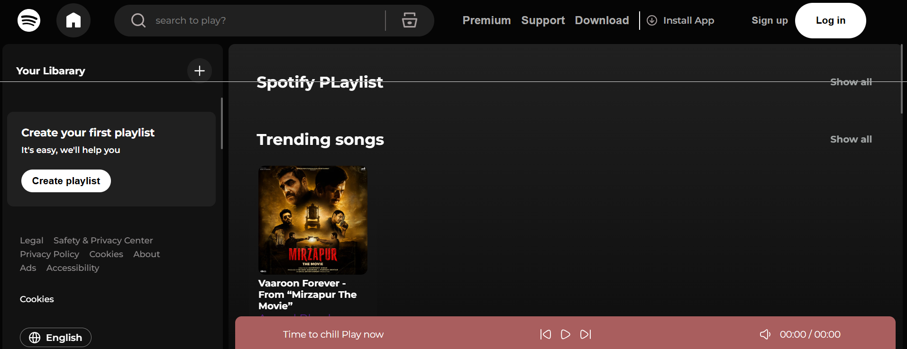

# 🎵 Spotify Clone

A responsive **Spotify-inspired music streaming web application** built to practice modern frontend web development.
The project recreates the core Spotify UI and music-player experience with features like playlists, song controls, volume control, seek bar, and responsive layouts.

> ⚠️ This project is created for **educational and portfolio purposes**. It is not affiliated with or endorsed by Spotify.

---

## 🚀 Live Demo

🔗 **Live Demo:** `Add your deployed website link here`

---

## 📸 Preview



---

## ✨ Features

### 🎧 Music Player

* Play / Pause songs
* Previous / Next song
* Song progress / seek bar
* Volume control
* Song duration display
* Current song information
* Playlist-based song selection

### 📂 Music Library

* Browse available songs
* Album / playlist sections
* Song cards with cover images
* Click a song to start playback

### 🎨 UI & Design

* Spotify-inspired dark interface
* Sidebar navigation
* Music library section
* Bottom music player
* Hover effects
* Custom scrollbars
* Responsive layout

### 📱 Responsive Design

The application is designed to work across:

* 💻 Desktop
* 💻 Laptop
* 📱 Mobile
* 📟 Tablet

---

## 🛠️ Technologies Used

### Frontend

* **HTML5**
* **CSS3**
* **JavaScript (ES6+)**

### APIs / Browser Features

* HTML5 `<audio>` API
* JavaScript DOM API
* Local/static music files

---

## 📁 Project Structure

```text
spotify-clone/
│
├── index.html
│
├── css/
│   ├── style.css
│   └── utility.css
│
├── js/
│   └── script.js
│
├── svg/
│   └── icons/
├── audios/
│   ├── song1.mp3
│   ├── song2.mp3
│   └── song3.mp3
│
├── screenshots/
│   └── preview.png
│
└── README.md
```

> Adjust the folder structure above according to your actual project.

---

## 🎵 How the Music Player Works

The application uses JavaScript to control the HTML5 audio player.

Basic flow:

```text
User selects song
       ↓
JavaScript identifies song
       ↓
Audio source is updated
       ↓
Audio starts playing
       ↓
Seek bar tracks current time
       ↓
User can control volume / playback
```

---

## ▶️ Run Locally

### 1. Clone the repository

```bash
git clone https://github.com/deepak-1252-git/Spotify---clone
```

### 2. Open the project

```bash
cd spotify-clone
```

### 3. Run the project

You can simply open:

```text
index.html
```

Or, for a better development experience, use **VS Code Live Server**.

---

## 🎮 Controls

| Control      | Function               |
| ------------ | ---------------------- |
| ▶️ Play      | Play current song      |
| ⏸️ Pause     | Pause current song     |
| ⏮️ Previous  | Play previous song     |
| ⏭️ Next      | Play next song         |
| 🔊 Volume    | Adjust volume          |
| 🎚️ Seek Bar | Change song position   |
| 🎵 Song Card | Select and play a song |

---

## 📱 Responsive Design

The layout uses CSS responsive techniques such as:

```css
@media (max-width: 768px) {
    /* Tablet / mobile styles */
}
```

The desktop layout adapts to smaller screen sizes by adjusting:

* Grid columns
* Sidebar
* Music player
* Song cards
* Navigation
* Spacing
* Font sizes

---

## 🧠 What I Learned

While building this project, I practiced:

* Semantic HTML structure
* CSS Grid
* CSS Flexbox
* Responsive web design
* DOM manipulation
* JavaScript event handling
* Audio API
* JavaScript arrays and objects
* Dynamic UI rendering
* Event listeners
* CSS hover effects
* Custom scrollbars
* Responsive media queries
* Organizing frontend project files

---

## 🔮 Future Improvements

Some features planned for future versions:

* [ ] User authentication
* [ ] Search functionality
* [ ] Create / edit playlists
* [ ] Like / unlike songs
* [ ] Recently played songs
* [ ] Queue management
* [ ] Shuffle mode
* [ ] Repeat mode
* [ ] Keyboard shortcuts
* [ ] Backend integration
* [ ] Database integration
* [ ] User profiles
* [ ] Cloud music storage
* [ ] Real-time music data
* [ ] Progressive Web App (PWA)

---

## 🔐 Disclaimer

This project is a **Spotify-inspired educational project** created for learning and portfolio purposes.

Spotify is a trademark of **Spotify AB**.
This project is not affiliated with, sponsored by, or endorsed by Spotify.

Music, images, logos, and other assets used in the project should be used only where you have the appropriate rights or permission.

---

## 👨‍💻 Author

**Deepak Bairwa**

GitHub: `https://github.com/deepak-1252-git`

---

## ⭐ Support

If you found this project useful for learning, consider giving the repository a ⭐ on GitHub.
